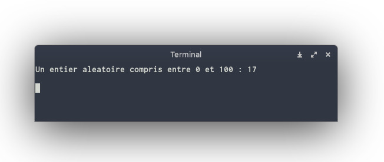
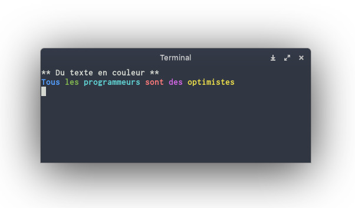
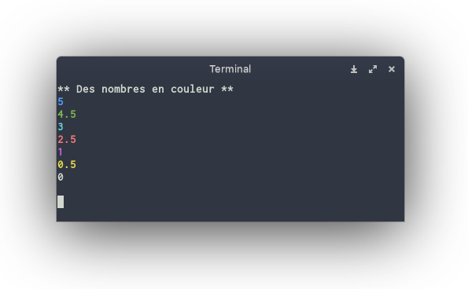
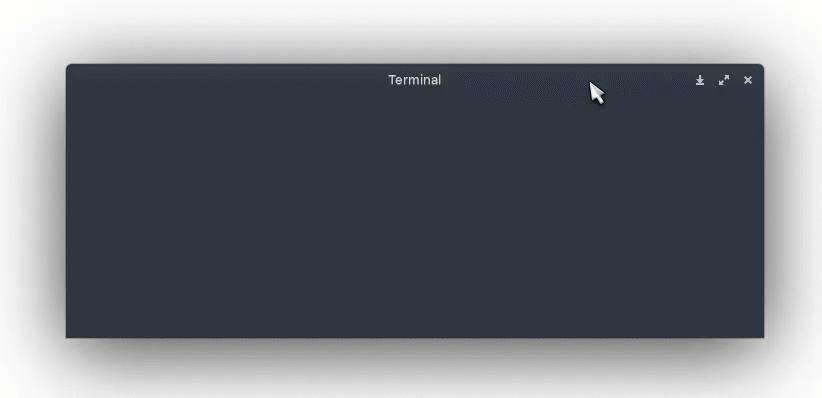
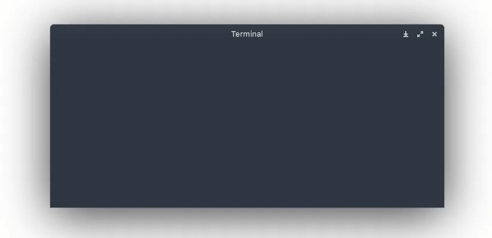

<h1  style="text-align: center;
            font-size: 3rem;
            background-color: var(--background);
            display: block;
            width: 900px;
            min-height: 90px;
            cursor: pointer;
            border: 3px solid #32CBF1;
            box-shadow:
                5px  -5px  0 -5px rgba(88, 133, 176, 0.1), 5px  -5px  #10BBE5,
                10px -10px 0 -5px rgba(88, 133, 176, 0.1), 10px -10px #0D98BA,
                15px -15px 0 -5px rgba(88, 133, 176, 0.1), 15px -15px #0A758F,
                20px -20px 0 -5px rgba(88, 133, 176, 0.1), 20px -20px #075264;">
game-tools-universel
</h1>

!!! LIEN ENTRE [game-tool-linux](https://github.com/patrick-etcheverry/game-tools-linux.git) et [game-tools](https://github.com/patrick-etcheverry/game-tools.git) de [Patrick Etcheverry](https://github.com/patrick-etcheverry)

game-tools est un petit module C++ contenant des sous-programmes utiles pour développer des petits jeux s'exécutant dans un terminal. Ce module met à disposition des fonctionnalités simples permettant d'effacer le terminal, de mettre le programme en pause,
d'afficher des éléments en couleur ou encore de générer un nombre entier aléatoire.


[](https://github.com/Naereen/badges/)

![Magic](https://img.shields.io/badge/Made%20with-Magic-orange?style=for-the-badge&logo=data:image/svg%2bxml;base64,PHN2ZyBpZD0iQ2FwYV8xIiBlbmFibGUtYmFja2dyb3VuZD0ibmV3IDAgMCA1MTIgNTEyIiBoZWlnaHQ9IjUxMiIgdmlld0JveD0iMCAwIDUxMiA1MTIiIHdpZHRoPSI1MTIiIHhtbG5zPSJodHRwOi8vd3d3LnczLm9yZy8yMDAwL3N2ZyI+PGc+PHBhdGggZD0ibTM5NS44MiAxODIuNjE2LTE4OC43MiAxODguNzItMTIuOTEgMS43Mi05LjM1IDIwLjU0LTM0LjMxIDM0LjMxLTExLjAxLS43My0xMS4yNSAyMi45OS01Ni40OCA1Ni40OGMtMi45MyAyLjkzLTYuNzcgNC4zOS0xMC42MSA0LjM5cy03LjY4LTEuNDYtMTAuNjEtNC4zOWwtMjIuNjItMjIuNjJoLS4wMWwtMjIuNjItMjIuNjNjLTUuODYtNS44Ni01Ljg2LTE1LjM2IDAtMjEuMjJsNzcuNjMtNzcuNjMgMTYuNi03LjAzIDUuNjYtMTUuMjMgMzQuMzEtMzQuMzEgMTQuODQtNC45MiA3LjQyLTE3LjM0IDE2Ny41Ny0xNjcuNTcgMzMuMjQgMzMuMjR6IiBmaWxsPSIjZjY2Ii8+PHBhdGggZD0ibTM5NS44MiAxMTYuMTQ2djY2LjQ3bC0xODguNzIgMTg4LjcyLTEyLjkxIDEuNzItOS4zNSAyMC41NC0zNC4zMSAzNC4zMS0xMS4wMS0uNzMtMTEuMjUgMjIuOTktNTYuNDggNTYuNDhjLTIuOTMgMi45My02Ljc3IDQuMzktMTAuNjEgNC4zOXMtNy42OC0xLjQ2LTEwLjYxLTQuMzlsLTIyLjYyLTIyLjYyIDMzNC42NC0zMzQuNjR6IiBmaWxsPSIjZTYyZTZiIi8+PHBhdGggZD0ibTUwNi42MSAyMDkuMDA2LTY5LjE0LTY5LjEzIDQzLjA1LTg4LjM4YzIuOC01Ljc1IDEuNjUtMTIuNjUtMi44OC0xNy4xNy00LjUyLTQuNTMtMTEuNDItNS42OC0xNy4xNy0yLjg4bC04OC4zOCA0My4wNS02OS4xMy02OS4xNGMtNC4zNS00LjM1LTEwLjkyLTUuNi0xNi41Ni0zLjE2LTUuNjUgMi40NS05LjIzIDguMDktOS4wNCAxNC4yNGwyLjg2IDkwLjQ1LTg1LjM3IDU3LjgzYy00LjkxIDMuMzItNy40IDkuMjItNi4zNiAxNS4wNCAxLjA0IDUuODMgNS40IDEwLjUxIDExLjE1IDExLjk0bDk2LjYyIDI0LjAxIDI0LjAxIDk2LjYyYzEuNDMgNS43NSA2LjExIDEwLjExIDExLjk0IDExLjE1Ljg3LjE2IDEuNzUuMjMgMi42Mi4yMyA0LjkyIDAgOS42LTIuNDIgMTIuNDItNi41OWw1Ny44My04NS4zNyA5MC40NSAyLjg2YzYuMTQuMTkgMTEuNzktMy4zOSAxNC4yNC05LjA0IDIuNDQtNS42NCAxLjE5LTEyLjIxLTMuMTYtMTYuNTZ6IiBmaWxsPSIjZmFiZTJjIi8+PHBhdGggZD0ibTI5Ni4yNiAyMTUuNzA2IDI0LjAxIDk2LjYyYzEuNDMgNS43NSA2LjExIDEwLjExIDExLjk0IDExLjE1Ljg3LjE2IDEuNzUuMjMgMi42Mi4yMyA0LjkyIDAgOS42LTIuNDIgMTIuNDItNi41OWw1Ny44My04NS4zNyA5MC40NSAyLjg2YzYuMTQuMTkgMTEuNzktMy4zOSAxNC4yNC05LjA0IDIuNDQtNS42NCAxLjE5LTEyLjIxLTMuMTYtMTYuNTZsLTY5LjE0LTY5LjEzIDQzLjA1LTg4LjM4YzIuOC01Ljc1IDEuNjUtMTIuNjUtMi44OC0xNy4xN3oiIGZpbGw9IiNmZDkwMjUiLz48cGF0aCBkPSJtNDY1IDQxNi45NjZjLTI1LjkyIDAtNDcgMjEuMDgtNDcgNDdzMjEuMDggNDcgNDcgNDcgNDctMjEuMDggNDctNDctMjEuMDgtNDctNDctNDd6IiBmaWxsPSIjZmFiZTJjIi8+PHBhdGggZD0ibTEwNCAyOC45NjZoLTEzdi0xM2MwLTguMjg0LTYuNzE2LTE1LTE1LTE1cy0xNSA2LjcxNi0xNSAxNXYxM2gtMTNjLTguMjg0IDAtMTUgNi43MTYtMTUgMTVzNi43MTYgMTUgMTUgMTVoMTN2MTNjMCA4LjI4NCA2LjcxNiAxNSAxNSAxNXMxNS02LjcxNiAxNS0xNXYtMTNoMTNjOC4yODQgMCAxNS02LjcxNiAxNS0xNXMtNi43MTYtMTUtMTUtMTV6IiBmaWxsPSIjZmVkODQzIi8+PHBhdGggZD0ibTIwNy4xIDM3MS4zMzYtMjIuMjYgMjIuMjYtNDUuMzItODcuNjIgMjIuMjYtMjIuMjZ6IiBmaWxsPSIjZmVkODQzIi8+PHBhdGggZD0ibTE4NC44NCAzOTMuNTk2IDIyLjI2LTIyLjI2LTIyLjY2LTQzLjgxLTIyLjI2NSAyMi4yNjV6IiBmaWxsPSIjZmFiZTJjIi8+PHBhdGggZD0ibTE1MC41MyA0MjcuOTA2LTIyLjI2IDIyLjI2LTQ1LjMyLTg3LjYyIDIyLjI2LTIyLjI2eiIgZmlsbD0iI2ZlZDg0MyIvPjxwYXRoIGQ9Im0xMjguMjcgNDUwLjE2NiAyMi4yNi0yMi4yNi0yMi42NTUtNDMuODE1LTIyLjI2IDIyLjI2eiIgZmlsbD0iI2ZhYmUyYyIvPjxjaXJjbGUgY3g9IjE1IiBjeT0iMTE5Ljk2OSIgZmlsbD0iIzVlZDhkMyIgcj0iMTUiLz48Y2lyY2xlIGN4PSIxMjgiIGN5PSIxOTkuOTY5IiBmaWxsPSIjZDU5OWVkIiByPSIxNSIvPjxjaXJjbGUgY3g9IjE5MiIgY3k9IjYzLjk2NCIgZmlsbD0iI2Y2NiIgcj0iMTUiLz48Y2lyY2xlIGN4PSIzMjgiIGN5PSI0MTUuOTY3IiBmaWxsPSIjMzFiZWJlIiByPSIxNSIvPjxjaXJjbGUgY3g9IjQ0MCIgY3k9IjMyNy45NjciIGZpbGw9IiNhZDc3ZTMiIHI9IjE0Ljk5OSIvPjwvZz48L3N2Zz4=)


## Installation

Télécharger les fichiers `game-tools.h` et `game-tools.cpp` présents dans ce dépôt puis ajoutez les à votre code.

**Exemple**

En supposant que :
- le code de votre jeu se trouve dans le fichier `main.cpp`,
- les fichiers `game-tools.h` et `game-tools.cpp` se trouvent dans le même répertoire que le fichier `main.cpp`,

vous pouvez intégrer les fonctionnalités du module game-tools dans votre code via une directive `include` :
```cpp
// . Importation Des Bibliothèques Nécessaires.
#include "game-tools.h"

// .  ==========================================================================
// .                                  MAIN                                      
// .  ==========================================================================

int main(void) {
    /**\
      * @goal                           :  Montrer comment utiliser la fonction 'effacer'
      * @author :                       :  T.Planche
    \**/

    // ! Définition Variables
    unsigned short int nombreAleatoire;

    //! Traitement

    // Générer un nombre aléatoire compris entre 0 et 100
    nombreAleatoire = random(0, 100);

    // Afficher le nombre aléatoire
    cout << "Un entier aleatoire compris entre 0 et 100 : " << nombreAleatoire << endl;

    return 0;
}
```

**Fichier de démo**

Si vous voulez tester le module `game-tools` vous pouvez également récupérer le fichier `main.cpp` : il contient un petit programme de démonstration qui illustre l'usage des différentes fonctionnalités proposées par `game-tools`.


## Utilisation


### Générer un nombre entier aléatoire

La fonction `random` permet de générer un nombre **entier** compris dans un intervalle défini par une valeur minimale et une valeur maximale.

Le code ci-dessous montre un exemple d'usage de la fonction `random` pour générer un nombre entier compris entre 0 et 100.

```cpp
// . Importation Des Bibliothèques Nécessaires.
#include "game-tools.h"


int main() {
   unsigned short int nombreAleatoire;

   // Générer un nombre aléatoire compris entre 0 et 100
   nombreAleatoire = random(0, 100);

   // Afficher le nombre aléatoire
   cout << "Un entier aleatoire compris entre 0 et 100 : " << nombreAleatoire << endl;

  return 0;
}
```




### Manipuler des couleurs
Le module *game-tools* met à disposition un type `Couleur` qui peut être utilisé pour déclarer des variables représentant des couleurs :  

```cpp
// . Importation Des Bibliothèques Nécessaires.
#include "game-tools.h"


int main(void)
{
   Couleur maCouleurPreferee; // une variable de type Couleur

   return 0;
}
```

Les variables de type `Couleur` peuvent prendre les valeurs suivantes bleu, vert, cyan, rouge, violet, jaune ou blanc :
```cpp
#include "game-tools.h"

int main(void) {
   Couleur maCouleurPreferee;
   maCouleurPreferee = bleu;

   return 0;
}
```


### Afficher du texte en couleur

Le module *game-tools* propose un sous-programme `afficherTexteEnCouleur` qui permet d'afficher une chaîne de caractères (ou un caractère) dans une couleur particulière. Cette couleur particulière sera de type `Couleur` (voir section précédente). Suite à l'affichage de la chaîne il est éventuellement possible d'ajouter un saut de ligne (voir exemple dans le code ci-dessous).

Le code ci-dessous donne quelques exemples d'usage du sous-programme `afficherTexteEnCouleur` :
```cpp
#include "game-tools.h"


// .  ==========================================================================
// .                                  MAIN                                      
// .  ==========================================================================

int main(void) {
    /**\
      * @goal                           :  Montrer comment utiliser la fonction 'afficherNombreEnCouleur'
      * @author :                       :  T.Planche
    \**/

    // Afficher des textes en couleur
    cout << "** Du texte en couleur **" << endl;

    /* Affiche le mot "Tous" en bleu SANS retour à la ligne
       (car utilisation de la valeur false en dernier paramètre) */
    afficherTexteEnCouleur("Tous ", bleu, false);

    afficherTexteEnCouleur("les ", vert, false);
    afficherTexteEnCouleur("programmeurs ", cyan, false);
    afficherTexteEnCouleur("sont ", rouge, false);
    afficherTexteEnCouleur("des ", violet, false);

    /* Affiche le mot "optimistes" en jaune AVEC retour à la ligne
       (car utilisation de la valeur true en dernier paramètre) */
    afficherTexteEnCouleur("optimistes", jaune, true);

    return 0;
}
```




**Remarques**

- La procédure `afficherTexteEnCouleur` peut également afficher de simples caractères en couleur. Par exemple :
```cpp
afficherTexteEnCouleur('A', cyan, false); // Affiche le caractère A en bleu cyan.
```
- Par défaut, aucun retour à la ligne n'est ajouté suite à l'affichage du texte. Ainsi, lorsqu'aucun retour à la ligne n'est nécessaire, on peut aussi bien écrire :
```cpp
afficherTexteEnCouleur("Tous ", bleu, false);
```
que :
```cpp
afficherTexteEnCouleur("Tous ", bleu);
```


### Afficher des nombres en couleur

La procédure `afficherNombreEnCouleur` permet d'afficher des nombres avec une couleur particulière. Son fonctionnement est similaire à celui de la procédure `afficherTexteEnCouleur`. Les couleurs utilisées devront être de type `Couleur` (voir section correspondante ci-dessus).

Les nombres à afficher en couleur peuvent être des nombres entiers ou des nombres à virgule. Suite à l'affichage d'un nombre il est également possible d'ajouter un saut de ligne (voir exemple dans le code ci-dessous).

Le code ci-dessous donne quelques exemples d'usage du sous-programme `afficherNombreEnCouleur` :
```cpp
// . Importation Des Bibliothèques Nécessaires.
#include "game-tools.h"


// .  ==========================================================================
// .                                  MAIN                                      
// .  ==========================================================================

/**\
  * @brief Montrer comment utiliser la fonction 'effacer'
  * @author : T.Planche
\**/
int main(void) {
    // Afficher des nombres en couleur
    cout << "** Des nombres en couleur **" << endl;

    /* Affiche le nombre 5 en bleu AVEC retour à la ligne
       (car utilisation de la valeur true en dernier paramètre) */
    afficherNombreEnCouleur(5, bleu, true);

    afficherNombreEnCouleur(4.5, vert, true);
    afficherNombreEnCouleur(3, cyan, true);
    afficherNombreEnCouleur(2.5, rouge, true);
    afficherNombreEnCouleur(1, violet, true);
    afficherNombreEnCouleur(0.5, jaune, true);
    afficherNombreEnCouleur(0, blanc, true);
    cout << endl;

    return 0;
}

```



**Remarque**

Par défaut, aucun retour à la ligne n'est ajouté suite à l'affichage du nombre. Ainsi, lorsqu'aucun retour à la ligne n'est nécessaire, on peut aussi bien écrire :
```cpp
afficherNombreEnCouleur(5, bleu, false);
```
que :
```cpp
afficherNombreEnCouleur(5, bleu);
```

### Mettre en pause

La procédure `pause` permet de stopper l'exécution du code durant un temps déterminé ou jusqu'à ce que l'utilisateur appuie sur une touche.

En appelant la procédure `pause` il est possible de spécifier une durée de pause exprimée en secondes. Si aucune durée n'est spécifiée, la pause perdure jusqu'à ce que l'utilisateur appuie sur une touche.

Le code ci-dessous donne quelques exemples d'usage de la procédure `pause` :

```cpp
// . Importation Des Bibliothèques Nécessaires.
#include "game-tools.h"


// .  ==========================================================================
// .                                  MAIN                                      
// .  ==========================================================================

/**\
  * @brief Montrer comment utiliser la fonction 'effacer'
  * @author : T.Planche
\**/
int main(void) {
    // Afficher un triangle coloré de manière progressive
    cout << "Appuyer sur Entree pour afficher progressivement un triangle en couleur..." << endl;

    /* Pas de durée spécifiée :
       -> code mis en pause jusqu'à ce que l'utilisateur appuie sur une touche */
    pause();  

    afficherTexteEnCouleur("*", bleu, true);
    pause(1); // Exécution mise en pause pendant 1 seconde.

    afficherTexteEnCouleur("**", vert, true);
    pause(1);
    afficherTexteEnCouleur("***", cyan, true);
    pause(1);
    afficherTexteEnCouleur("****", rouge, true);
    pause(1);
    afficherTexteEnCouleur("******", jaune, true);
    cout << endl;

    return 0;
}

```




### Effacer le contenu du terminal

La procédure `effacer` permet d'effacer le contenu affiché dans le terminal. Le code ci-dessous donne un exemple d'utilisation de cette fonctionnalité :

```cpp
// . Importation Des Bibliothèques Nécessaires.
#include "game-tools.h"


// .  ==========================================================================
// .                                  MAIN                                      
// .  ==========================================================================
/**\
  * @brief Montrer comment utiliser la fonction 'effacer'
  * @author : T.Planche
\**/
int main(void) {
    // Afficher un triangle coloré de manière progressive
    pause();
    cout << "** Un triangle en couleur qui s'affiche progressivement **" << endl;
    afficherTexteEnCouleur("*", bleu, true);
    pause(1);
    afficherTexteEnCouleur("**", vert, true);
    pause(1);
    afficherTexteEnCouleur("***", cyan, true);
    pause(1);
    afficherTexteEnCouleur("****", rouge, true);
    pause(1);
    afficherTexteEnCouleur("******", jaune, true);

    // Mettre en pause le programme
    cout << endl;
    cout << "Appuyer sur Entree pour effacer l'ecran et afficher le triangle en sens inverse...";
    pause();

    effacer(); // <--- ON EFFACE LE CONTENU DU TERMINAL AVANT D'AFFICHER LE SECOND TRIANGLE

    // Afficher le triangle coloré de manière progressive et en sens inverse
    afficherTexteEnCouleur("******", jaune, true);
    pause(1);
    afficherTexteEnCouleur("****", rouge, true);
    pause(1);
    afficherTexteEnCouleur("***", cyan, true);
    pause(1);
    afficherTexteEnCouleur("**", vert, true);
    pause(1);
    afficherTexteEnCouleur("*", bleu, true);

    return 0;
}

```




### Couleur aléatoire

La fonction `couleurAleatoire` retourne aléatoirement une couleur `Couleur`. Le code ci-dessous donne un exemple d'utilisation de cette fonctionnalité :

```cpp
// . Importation Des Bibliothèques Nécessaires.
#include "game-tools.h"


// .  ==========================================================================
// .                                  MAIN                                      
// .  ==========================================================================

/**\
  * @brief Montrer comment utiliser la fonction 'effacer'
  * @author : T.Planche
\**/
int main(void) {
    // . Affiche un texte de couleur aléatoire.
	afficherTexteEnCouleur("Couleur Aléatoire", couleurAleatoire(), true);	

    return 0;
}
```

